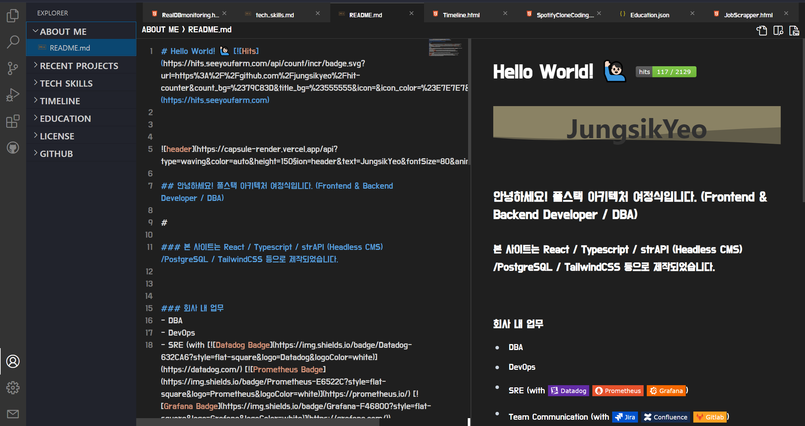
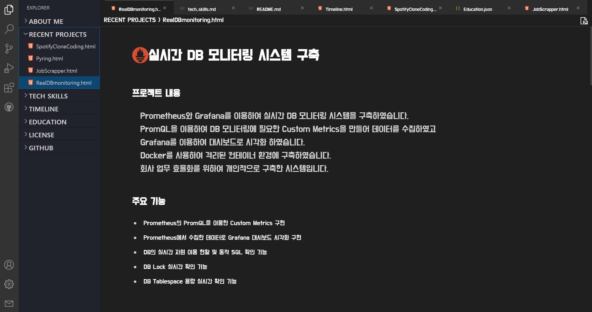
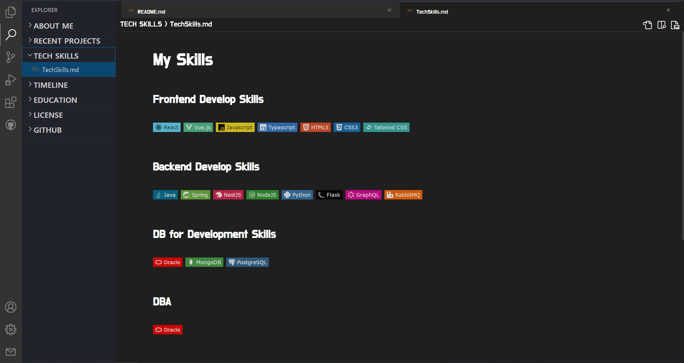
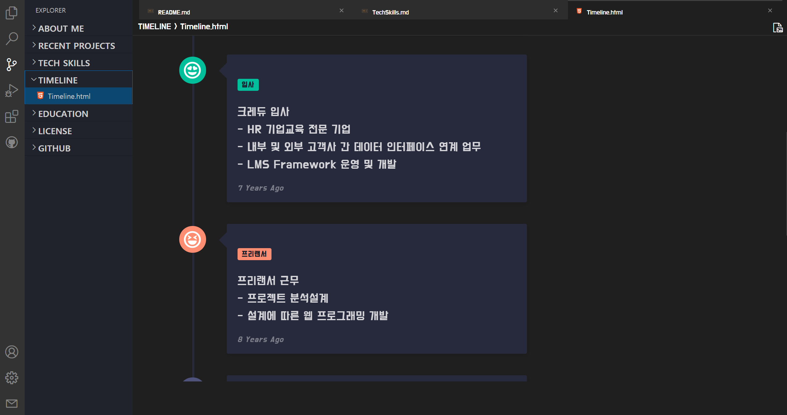
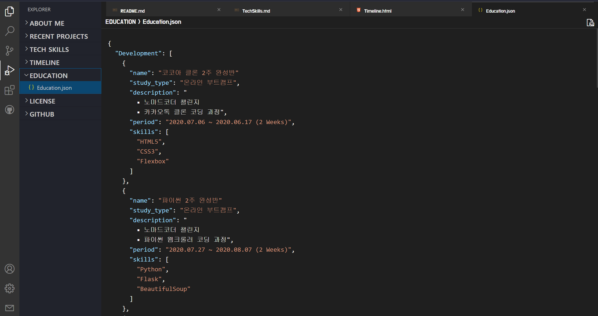

# 🙋🏻‍♂️ 포트폴리오 프로젝트 : VSCode 클론 코딩

## 프로젝트 내용
개인 포트폴리오를 VSCode IDE 클론 코딩으로 제작하였습니다.

Frontend는 React와 Typescript 그리고 TailwindCSS를 사용하였고
Backend는 Strapi와 PostgreSQL로 Headless CMS를 구축하여 연동하였습니다.

Markdown / HTML / JSON 형식의 파일형식을 지원합니다.

개발자다운 포트폴리오를 만들기 위해 고민하다가 개발자가 주로 사용하는 VSCode IDE툴에서 아이디어를 얻어 제작하게 되었습니다.

## 주요 기능
- Markdown / HTML / JSON 파일 형식 지원
- Markdown 파일 형식의 소스코드와 콘텐츠 분할화면 기능
- Tab Drag & Drop 기능
- Github Repository 연동
- 소스 모드 시 Minimap 기능
- 분할 모드 시 동시 스크롤 기능
- Color Theme 변경

## 사용 기술

## 링크
### [https://portfolio-yjs.netlify.app/](https://portfolio-yjs.netlify.app)

## 스크린샷
<video src="./public/screenshot/portfolio_full.mp4" width="850" autoplay loop controls></video>

